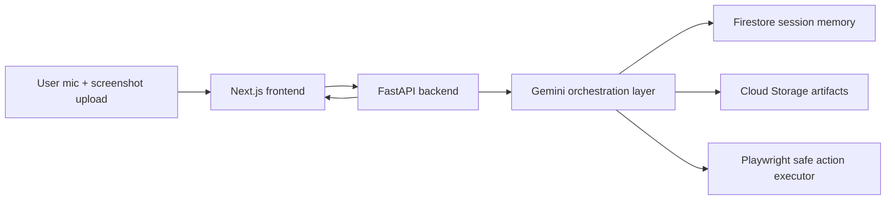

# LiveLens

Your voice-first copilot for confusing online tasks.

LiveLens is a screenshot-first multimodal MVP for the Gemini Live Agent Challenge. It helps a user complete confusing online workflows, especially forms and application flows, by analyzing what is visible on screen, guiding the next step in a spoken-friendly way, keeping a live checklist, and optionally executing safe browser actions after explicit confirmation.

## Why this MVP

The first version optimizes for demo reliability:

- screenshot upload is the primary visual input so grounding is stable
- browser speech recognition and speech synthesis provide the voice-first feel quickly
- the orchestration flow is structured so live screen streaming can be added later
- all browser actions stay behind explicit confirmation

## Monorepo structure

```text
/livelens
  /frontend                Next.js 14 app router UI
    /app
    /components
    /lib
  /backend                 FastAPI orchestration and services
    /app
      /api
      /core
      /models
      /services
    /tests
  /docs
    architecture.mmd
    demo-script.md
  README.md
```

## Core features

- Voice-first session UI with browser microphone input and spoken agent replies
- Screenshot-based visual understanding grounded in visible evidence
- Observe, Assist, and Act modes
- Live checklist and action log
- Safe Playwright action layer with confirmation
- Session summary with completed steps, remaining tasks, and blockers
- Firestore-ready session memory and Cloud Storage-ready artifact uploads
- Cloud Run deployment assets

## Architecture

Mermaid source lives in [docs/architecture.mmd](/C:/Users/Amsan/Downloads/Gemini%20Live%20Agent%20Challenge/livelens/docs/architecture.mmd).



## Stack

- Frontend: Next.js 14, TypeScript, Tailwind CSS, Framer Motion
- Backend: FastAPI, Pydantic, Google GenAI SDK, Playwright
- Google Cloud: Cloud Run, Firestore, Cloud Storage
- AI: Gemini multimodal reasoning with graceful fallback if a key is missing

## Key files

- [frontend/app/page.tsx](/C:/Users/Amsan/Downloads/Gemini%20Live%20Agent%20Challenge/livelens/frontend/app/page.tsx): branded landing page
- [frontend/app/session/page.tsx](/C:/Users/Amsan/Downloads/Gemini%20Live%20Agent%20Challenge/livelens/frontend/app/session/page.tsx): main live session UI
- [frontend/components/voice-controls.tsx](/C:/Users/Amsan/Downloads/Gemini%20Live%20Agent%20Challenge/livelens/frontend/components/voice-controls.tsx): browser mic + speech synthesis loop
- [backend/app/api/routes.py](/C:/Users/Amsan/Downloads/Gemini%20Live%20Agent%20Challenge/livelens/backend/app/api/routes.py): API surface
- [backend/app/services/orchestrator.py](/C:/Users/Amsan/Downloads/Gemini%20Live%20Agent%20Challenge/livelens/backend/app/services/orchestrator.py): workflow orchestration
- [backend/app/services/gemini_service.py](/C:/Users/Amsan/Downloads/Gemini%20Live%20Agent%20Challenge/livelens/backend/app/services/gemini_service.py): Gemini integration
- [backend/app/services/action_executor.py](/C:/Users/Amsan/Downloads/Gemini%20Live%20Agent%20Challenge/livelens/backend/app/services/action_executor.py): safe Playwright execution

## Local setup

### 1. Frontend

```bash
cd livelens/frontend
cp .env.example .env.local
npm install
npm run dev
```

Frontend runs on [http://localhost:3000](http://localhost:3000).

### 2. Backend

```bash
cd livelens/backend
python -m venv .venv
. .venv/bin/activate
pip install -r requirements.txt
playwright install chromium
cp .env.example .env
uvicorn app.main:app --reload --port 8000
```

Backend runs on [http://localhost:8000](http://localhost:8000).

### 3. Root shortcut

```bash
cd livelens
npm install
npm run dev:frontend
```

## Environment variables

### Frontend

See [frontend/.env.example](/C:/Users/Amsan/Downloads/Gemini%20Live%20Agent%20Challenge/livelens/frontend/.env.example).

- `NEXT_PUBLIC_API_BASE_URL`: backend base URL

### Backend

See [backend/.env.example](/C:/Users/Amsan/Downloads/Gemini%20Live%20Agent%20Challenge/livelens/backend/.env.example).

- `GEMINI_API_KEY`: required for real Gemini analysis and richer responses
- `GEMINI_MODEL`: defaults to `gemini-1.5-flash`
- `GOOGLE_CLOUD_PROJECT`: your GCP project ID
- `FIRESTORE_COLLECTION`: Firestore collection for sessions
- `STORAGE_BUCKET`: Cloud Storage bucket for screenshots and artifacts
- `USE_LOCAL_STORAGE`: keep `true` for local dev
- `PLAYWRIGHT_HEADLESS`: Playwright browser mode
- `BROWSER_TARGET_URL`: optional page URL for real safe-action execution
- `ALLOWED_ORIGINS`: comma-separated origins for the frontend

## API routes

- `POST /api/sessions/start`
- `GET /api/sessions/{session_id}`
- `POST /api/sessions/{session_id}/screenshot`
- `POST /api/sessions/{session_id}/analyze`
- `POST /api/sessions/{session_id}/utterance`
- `POST /api/sessions/{session_id}/respond`
- `POST /api/sessions/{session_id}/mode`
- `POST /api/sessions/{session_id}/actions/confirm`
- `POST /api/sessions/{session_id}/actions/execute`
- `POST /api/sessions/{session_id}/finalize`

## Google Cloud setup

### Firestore

1. Create a Firestore database in Native mode.
2. Set `GOOGLE_CLOUD_PROJECT`.
3. Set `FIRESTORE_COLLECTION`, or keep the default.
4. Provide application default credentials locally or a service account in Cloud Run.

### Cloud Storage

1. Create a bucket for screenshots and session artifacts.
2. Set `STORAGE_BUCKET`.
3. Set `USE_LOCAL_STORAGE=false` in deployed environments.

### Cloud Run deployment

```bash
cd livelens/backend
chmod +x deploy-cloud-run.sh
export GOOGLE_CLOUD_PROJECT="your-project-id"
export REGION="us-central1"
./deploy-cloud-run.sh
```

You also need to set runtime environment variables in Cloud Run:

- `GEMINI_API_KEY`
- `GEMINI_MODEL`
- `GOOGLE_CLOUD_PROJECT`
- `FIRESTORE_COLLECTION`
- `STORAGE_BUCKET`
- `USE_LOCAL_STORAGE=false`
- `ALLOWED_ORIGINS=https://your-frontend-domain`

## Demo flow for judges

The short judge script lives in [docs/demo-script.md](/C:/Users/Amsan/Downloads/Gemini%20Live%20Agent%20Challenge/livelens/docs/demo-script.md).

Fastest happy path:

1. Open the landing page.
2. Start a session.
3. Upload an application screenshot.
4. Ask for help finishing the application.
5. Interrupt with a follow-up question.
6. Switch to `Act`.
7. Approve one safe action.
8. Finalize the summary.

## Limitations

- Screenshot-first is the reliable MVP path; full live screen streaming is intentionally deferred.
- Browser speech recognition depends on the user browser.
- Playwright actions are conservative and safest when `BROWSER_TARGET_URL` is set to a controlled demo page.
- Firestore and Cloud Storage gracefully fall back to local memory and local disk for local development.

## Future improvements

- Gemini Live native audio streaming
- continuous screen-share frames instead of refresh-based screenshots
- better element grounding using OCR and structured UI extraction
- persistent multi-session history and downloadable artifacts
- richer Playwright targeting with selector confidence scoring

## Placeholders you must fill in

- `GEMINI_API_KEY`
- `GOOGLE_CLOUD_PROJECT`
- `STORAGE_BUCKET`
- optionally `BROWSER_TARGET_URL` for live action demos
- frontend production API URL in `NEXT_PUBLIC_API_BASE_URL`

