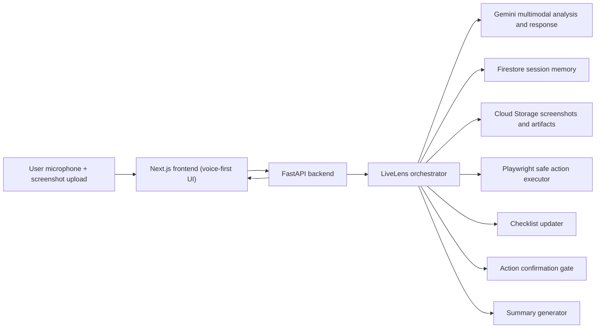

# LiveLens

**Tagline:** Your voice-first copilot for confusing online tasks.

LiveLens is a production-style MVP for the Gemini Live Agent Challenge. It helps users complete high-friction online workflows by combining voice interaction, screenshot-based visual grounding, guided checklist updates, and safe action confirmation.

## What problem this solves

People get stuck in forms and application portals because:

- they do not understand what a field means
- they miss required warnings hidden in long pages
- they lose confidence and abandon tasks

Traditional chatbots are disconnected from what is visible on the screen. LiveLens is grounded in current visual context and responds like a real-time agent.

## Solution in one minute

1. Go to `/session`.
2. Upload a screenshot of where you're stuck.
3. Ask in voice or text: "Help me finish this application."
4. Agent explains visible UI elements and updates checklist.
5. Follow guided steps — approve any proposed actions.
6. Session ends with concise summary: completed, remaining, blockers.

## Why judges should care

- Voice-first UX with interruption feel, plus robust text fallback.
- Grounded visual assistance that references visible evidence only.
- Clear safety model for automation with explicit user confirmation.
- Real Google Cloud architecture that is deployment-ready.

## Useful links

- Submission checklist: [submission-checklist.md](docs/submission-checklist.md)

## Architecture

Diagram source: [architecture.mmd](docs/architecture.mmd)



## Google Cloud usage

LiveLens explicitly uses Google Cloud in the backend service layer:

- **Cloud Run**: deploys FastAPI backend container
- **Firestore**: stores session metadata, transcript, checklist, and action logs
- **Cloud Storage**: stores screenshots and session artifacts
- **Gemini API**: multimodal screenshot analysis + response generation

Key backend modules:

- [routes.py](backend/app/api/routes.py)
- [session_store.py](backend/app/services/session_store.py)
- [storage_service.py](backend/app/services/storage_service.py)
- [gemini_service.py](backend/app/services/gemini_service.py)

## Grounding and hallucination mitigation

LiveLens is designed to reduce hallucination risk in workflow guidance:

- screenshot-first context for deterministic visual grounding
- prompts instruct Gemini to describe only visible evidence
- agent explicitly notes uncertainty when context is missing
- no hidden-element assumptions in guidance
- safe actions require explicit confirmation in `Act` mode
- ambiguous target actions fail safely and are logged

## Monorepo structure

```text
/livelens
  /frontend
  /backend
  /docs
  README.md
```

## Reproducible testing

Follow these steps to run LiveLens locally end-to-end from a clean clone.

### Prerequisites

- Node.js 18+
- Python 3.11+
- A [Gemini API key](https://aistudio.google.com/app/apikey) (free tier works for light testing)

### 1. Clone the repo

```bash
git clone https://github.com/YOUR_USERNAME/YOUR_REPO_NAME.git
cd YOUR_REPO_NAME
```

### 2. Configure the backend

```bash
cd livelens/backend
cp .env.example .env
```

Open `.env` and set:

```
GEMINI_API_KEY=your-gemini-api-key
GEMINI_MODEL=gemini-2.5-flash
USE_LOCAL_STORAGE=true
```

Everything else can stay as the default — Firestore and Cloud Storage are not required for local testing (the app falls back to in-memory session storage and local file storage automatically).

### 3. Start the backend

```bash
cd livelens/backend
python -m venv .venv
source .venv/bin/activate        # Windows: .venv\Scripts\activate
pip install -r requirements.txt
playwright install chromium
uvicorn app.main:app --reload --port 8000
```

Backend is ready when you see: `Application startup complete.`

Verify: `curl http://localhost:8000/health` → `{"status":"ok"}`

### 4. Configure the frontend

```bash
cd livelens/frontend
cp .env.example .env.local
```

`.env.local` should contain:

```
NEXT_PUBLIC_API_BASE_URL=http://localhost:8000
```

### 5. Start the frontend

```bash
cd livelens/frontend
npm install
npm run dev
```

Open `http://localhost:3000`.

### 6. Test the full flow

1. Click **Start a session →** on the landing page
2. Upload any screenshot of a form or UI you find confusing (PNG or JPG)
3. Wait for Gemini to analyze it — a summary appears on the left and the checklist updates
4. Type or speak a question (e.g. *"What does this field mean?"*)
5. Receive a grounded voice + text response from the agent
6. Click **Wrap up session** to generate a summary

### 7. Run the backend test suite

```bash
cd livelens/backend
source .venv/bin/activate
pytest tests/ -v
```

Expected: all tests pass (15 tests covering orchestrator state machine and Gemini service).

### Live deployment

The backend is deployed at:
`https://livelens-backend-386263955104.us-central1.run.app`

To test against the live deployment, set `NEXT_PUBLIC_API_BASE_URL` to that URL in `.env.local` instead of `localhost:8000`.

---

## Quick start

### One command (recommended)

From the repo root:

```bash
cd livelens
npm run dev
```

This starts backend and frontend together:

- frontend: `http://localhost:3000`
- backend: `http://localhost:8000`

### Frontend

```bash
cd livelens/frontend
cp .env.example .env.local
npm install
npm run dev
```

### Backend

```bash
cd livelens/backend
python -m venv .venv
. .venv/bin/activate
pip install -r requirements.txt
playwright install chromium
cp .env.example .env
uvicorn app.main:app --reload --port 8000
```

## Dockerized startup

### Start containers

```bash
cd livelens
npm run docker:up
```

### Stop containers

```bash
cd livelens
npm run docker:down
```

Services:

- frontend: `http://localhost:3000`
- backend: `http://localhost:8000`

## Environment variables

### Frontend

- `NEXT_PUBLIC_API_BASE_URL`

### Backend

- `GEMINI_API_KEY`
- `GEMINI_MODEL` (default: `gemini-2.5-flash`)
- `GOOGLE_CLOUD_PROJECT`
- `FIRESTORE_COLLECTION`
- `STORAGE_BUCKET`
- `USE_LOCAL_STORAGE`
- `PLAYWRIGHT_HEADLESS`
- `BROWSER_TARGET_URL`
- `ALLOWED_ORIGINS`

## API routes

- `POST /api/sessions/start`
- `GET /api/sessions/{session_id}`
- `POST /api/sessions/{session_id}/screenshot`
- `POST /api/sessions/{session_id}/analyze`
- `POST /api/sessions/{session_id}/utterance`
- `POST /api/sessions/{session_id}/actions/confirm`
- `POST /api/sessions/{session_id}/finalize`

## Deployment to Cloud Run

```bash
cd livelens/backend
export GOOGLE_CLOUD_PROJECT="your-project-id"
export REGION="us-central1"
./deploy-cloud-run.sh
```

Set Cloud Run env vars:

- `GEMINI_API_KEY`
- `GEMINI_MODEL`
- `GOOGLE_CLOUD_PROJECT`
- `FIRESTORE_COLLECTION`
- `STORAGE_BUCKET`
- `USE_LOCAL_STORAGE=false`
- `ALLOWED_ORIGINS=https://your-frontend-domain`

## Placeholders you must fill

- `GEMINI_API_KEY`
- `GOOGLE_CLOUD_PROJECT`
- `STORAGE_BUCKET`
- `NEXT_PUBLIC_API_BASE_URL`
- optional `BROWSER_TARGET_URL` for controlled action demos

## Repo submission-ready assets

- Product overview and setup: this README
- Architecture diagram: [architecture.mmd](docs/architecture.mmd)
- Submission checklist: [submission-checklist.md](docs/submission-checklist.md)

